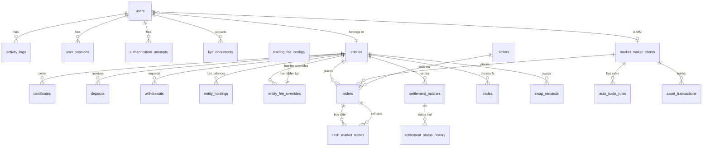

# NIHA Carbon Platform - Database Schema Documentation

**Generated**: 2026-02-10
**Database**: PostgreSQL 16 | **ORM**: SQLAlchemy 2.x (async) | **Migrations**: Alembic
**Tables**: 31 | **Indexes**: 95 | **Foreign Keys**: 51 | **Enums**: 31

---

## Quick Reference ER Diagram



---

## Table Inventory (31 tables)

### Core Domain
| Table | Purpose | Rows |
|-------|---------|------|
| `users` | Platform users (admin, traders, MM) | 5 |
| `entities` | Legal entities (companies) | 4 |
| `contact_requests` | NDA/KYC onboarding requests | 3 |

### Trading
| Table | Purpose | Rows |
|-------|---------|------|
| `orders` | Order book (BUY/SELL, CEA_CASH/SWAP) | 0 |
| `cash_market_trades` | Executed trades | 0 |
| `trades` | Legacy trade records | 0 |
| `certificates` | CEA/EUA certificate inventory | 0 |
| `swap_requests` | CEA-EUA swap requests | 0 |
| `sellers` | External CEA sellers | 0 |

### Financial
| Table | Purpose | Rows |
|-------|---------|------|
| `deposits` | Wire transfer deposits + AML hold | 0 |
| `withdrawals` | Withdrawal requests | 0 |
| `entity_holdings` | Asset balances (EUR/CEA/EUA per entity) | 0 |
| `trading_fee_configs` | Market-level fee rates | 0 |
| `entity_fee_overrides` | Per-entity fee overrides | 0 |

### Market Making
| Table | Purpose | Rows |
|-------|---------|------|
| `market_maker_clients` | MM accounts | 1 |
| `auto_trade_rules` | Per-MM auto-trade rules | 0 |
| `auto_trade_settings` | Global liquidity targets (legacy) | 0 |
| `auto_trade_market_settings` | Per-market auto-trade config | 0 |

### Settlement
| Table | Purpose | Rows |
|-------|---------|------|
| `settlement_batches` | T+N settlement tracking | 0 |
| `settlement_status_history` | Settlement status audit trail | 0 |

### Pricing
| Table | Purpose | Rows |
|-------|---------|------|
| `price_history` | Certificate price history | 18 |
| `scraping_sources` | Price scraping config | 1 |
| `exchange_rate_sources` | Currency exchange rate sources | 0 |

### Audit & Auth
| Table | Purpose | Rows |
|-------|---------|------|
| `ticket_logs` | Comprehensive audit trail | 3 |
| `asset_transactions` | Asset movement audit trail | 0 |
| `liquidity_operations` | Liquidity creation audit | 0 |
| `activity_logs` | User activity log | 0 |
| `user_sessions` | Session tracking | 0 |
| `authentication_attempts` | Login attempt history | 2 |
| `kyc_documents` | KYC document uploads | 0 |

### Configuration
| Table | Purpose | Rows |
|-------|---------|------|
| `mail_config` | Email provider settings | 0 |

---

## Enumeration Types (31 active)

### User & Auth
| Enum | Values |
|------|--------|
| `userrole` | ADMIN, MM, NDA, REJECTED, KYC, APPROVED, FUNDING, AML, CEA, CEA_SETTLE, SWAP, EUA_SETTLE, EUA |
| `contactstatus` | NDA, REJECTED, KYC |
| `kycstatus` | PENDING, APPROVED, REJECTED |
| `documenttype` | REGISTRATION, TAX_CERTIFICATE, ARTICLES, FINANCIAL_STATEMENTS, GHG_PERMIT, ID, PROOF_AUTHORITY, CONTACT_INFO |
| `documentstatus` | PENDING, APPROVED, REJECTED |
| `jurisdiction` | EU, CN, HK, OTHER |

### Trading
| Enum | Values |
|------|--------|
| `orderside` | BUY, SELL |
| `orderstatus` | OPEN, PARTIALLY_FILLED, FILLED, CANCELLED |
| `markettype` | CEA_CASH, SWAP |
| `certificatetype` | EUA, CEA |
| `certificatestatus` | AVAILABLE, RESERVED, SOLD |
| `tradetype` | BUY, SELL, SWAP |
| `tradestatus` | PENDING, CONFIRMED, COMPLETED, CANCELLED |
| `swapstatus` | OPEN, MATCHED, COMPLETED, CANCELLED |

### Financial
| Enum | Values |
|------|--------|
| `assettype` | EUR, CEA, EUA |
| `currency` | EUR, USD, CNY, HKD |
| `depositstatus` | PENDING, CONFIRMED, ON_HOLD, CLEARED, REJECTED |
| `withdrawalstatus` | PENDING, PROCESSING, COMPLETED, REJECTED |
| `transactiontype` | DEPOSIT, WITHDRAWAL, TRADE_DEBIT, TRADE_CREDIT, TRADE_BUY, TRADE_SELL, ADJUSTMENT |

### Market Making
| Enum | Values |
|------|--------|
| `marketmakertype` | CEA_BUYER, CEA_SELLER, EUA_OFFER |
| `autotradepricemode` | fixed, spread_from_best, percentage_from_market, random_spread |
| `autotradequantitymode` | fixed, percentage_of_balance, random_range |

### Settlement
| Enum | Values |
|------|--------|
| `settlementstatus` | PENDING, TRANSFER_INITIATED, IN_TRANSIT, AT_CUSTODY, SETTLED, FAILED |
| `settlementtype` | CEA_PURCHASE, SWAP_CEA_TO_EUA |

### Other
| Enum | Values |
|------|--------|
| `ticketstatus` | SUCCESS, FAILED |
| `scrapelibrary` | HTTPX, BEAUTIFULSOUP, SELENIUM, PLAYWRIGHT |
| `scrapestatus` | SUCCESS, FAILED, TIMEOUT |
| `mailprovider` | resend, smtp |
| `holdtype` | FIRST_DEPOSIT, SUBSEQUENT, LARGE_AMOUNT |
| `amlstatus` | PENDING, ON_HOLD, CLEARED, REJECTED |
| `authmethod` | PASSWORD, MAGIC_LINK |

---

## Foreign Key Map

### `users` (referenced by 24 FKs - hub table)
```
activity_logs.user_id -> users.id
authentication_attempts.user_id -> users.id
user_sessions.user_id -> users.id
kyc_documents.user_id -> users.id
kyc_documents.reviewed_by -> users.id
market_maker_clients.user_id -> users.id
market_maker_clients.created_by -> users.id
asset_transactions.created_by -> users.id
deposits.user_id -> users.id
deposits.confirmed_by -> users.id
deposits.cleared_by_admin_id -> users.id
deposits.rejected_by_admin_id -> users.id
withdrawals.user_id -> users.id
withdrawals.processed_by -> users.id
withdrawals.completed_by -> users.id
withdrawals.rejected_by -> users.id
settlement_status_history.updated_by -> users.id
trading_fee_configs.updated_by -> users.id
entity_fee_overrides.updated_by -> users.id
entities.kyc_approved_by -> users.id
contact_requests.agent_id -> users.id
ticket_logs.user_id -> users.id
liquidity_operations.created_by -> users.id
users.created_by -> users.id (self-ref)
```

### `entities` (referenced by 11 FKs)
```
users.entity_id -> entities.id
certificates.entity_id -> entities.id
deposits.entity_id -> entities.id
withdrawals.entity_id -> entities.id
entity_holdings.entity_id -> entities.id
entity_fee_overrides.entity_id -> entities.id
orders.entity_id -> entities.id
settlement_batches.entity_id -> entities.id
trades.buyer_entity_id -> entities.id
trades.seller_entity_id -> entities.id
swap_requests.entity_id -> entities.id
```

### `market_maker_clients` (referenced by 5 FKs)
```
auto_trade_rules.market_maker_id -> market_maker_clients.id
orders.market_maker_id -> market_maker_clients.id
cash_market_trades.market_maker_id -> market_maker_clients.id
asset_transactions.market_maker_id -> market_maker_clients.id
ticket_logs.market_maker_id -> market_maker_clients.id
```

### `orders` (referenced by 3 FKs)
```
cash_market_trades.buy_order_id -> orders.id
cash_market_trades.sell_order_id -> orders.id
settlement_batches.order_id -> orders.id
```

---

## Migration Chain

### Active Head: `fe405e6fd550` (contact first/last name)

```
2026_01_29_baseline (empty, app creates schema)
    |
    +-> 2026_01_29_mail_config
    +-> 2026_01_29_onboarding (unified onboarding status)
    +-> 2026_01_29_simplify (simplify OnboardingStatus)
    +-> 2026_01_29_nda_only (unify UserRole/ContactStatus)
    +-> 2026_01_29_full_flow (extend for full flow)
    +-> 2026_01_30_request_type (drop request_type)
         |
         +---> 2026_01_30_add_mm (add MM role)
         |         |
         |         +--> 2026_01_30_mm_types [MERGE] <--+
         |                    |                         |
         +---> 2026_01_30_exchange_rates ---------------+
         |         |
         |         +--> 2026_01_30_eur_price
         |
         +--> 2026_01_30_fees (trading fee config)
              |
              +--> 2026_02_02_auto_trade -> random_int -> execution
              |         |                       |
              |         +--> add_random_spread_cols
              |         +--> d96d8a0b2dce (eua_balance)
              |         +--> increase_anon_code_len
              |
              +--> auto_trade_settings -> auto_trade_market_settings
              |         |
              |         +--> simplified_auto_trade -> internal_trade_settings
              |         +--> liquidity_to_target
              |
              +--> 2026_02_06_pending (delete orders)
              +--> 2026_02_07_is_demo -> 2026_02_07_drop_demo
              +--> 2026_02_07_at_fields (variation fields)
              +--> fe405e6fd550 (contact first/last name) <- HEAD
```

### Archived Migrations (pre-baseline)
Located in `backend/alembic/versions/archive/`:
- d4c523e409d9 - Market makers + audit logging
- f873b8199176 - Liquidity operations
- 02f592fbda69 - MM type + EUR balance
- 2026_01_21_eur_migration - USD to EUR
- 2026_01_21_add_market - Market field on orders
- 2026_01_21_market_based_restructure - MM restructure
- 2026_01_25_add_settlement_system - Settlement
- 2026_01_27_add_aml_hold - AML hold
- 2026_01_27_add_withdrawals - Withdrawals
- 2026_01_29_drop_contact_request_reference - Drop reference

---

## Known Issues & Technical Debt

| # | Issue | Severity | Reference |
|---|-------|----------|-----------|
| 1 | DepositStatus.CONFIRMED dead code in backoffice.py | CRITICAL | backoffice.py:689,1019 |
| 2 | Duplicate columns in migration 2026_02_02_execution | CRITICAL | Will fail on fresh alembic upgrade |
| 3 | counterparty_type phantom field in API | CRITICAL | settlement.py:157 |
| 4 | 9 orphan legacy enums from init.sql | WARNING | init.sql |
| 5 | Port 5434 vs documented 5433 | WARNING | docker-compose.yml vs CLAUDE.md |
| 6 | Migration head not updated in CLAUDE.md | WARNING | CLAUDE.md |
| 7 | No DB-level defaults | WARNING | All tables |
| 8 | timestamp without time zone | WARNING | All tables |
| 9 | Missing UniqueConstraint on EntityHolding | WARNING | entity_holdings |
| 10 | ~80 datetime.utcnow() calls | INFO | Tracked in CLAUDE.md |
| 11 | is_demo add/drop migration pair | INFO | Can clean up |
| 12 | Dual interval systems in auto_trade_rules | INFO | minutes + seconds |
| 13 | Single 1401-line models.py | INFO | Consider splitting |
| 14 | Backups available in /backups/ | INFO | Recovery source |

---

## Backup & Recovery

### Available Sources (priority order)
1. **Live Database**: `docker compose exec db pg_dump -U niha_user -d niha_carbon`
2. **SQL Backup**: `backups/backup_before_recovery_20260210_010357.sql`
3. **pg_dump Binary**: `backups/source_5433_20260209_191922.dump`
4. **SQLAlchemy Models**: `backend/app/models/models.py` (1401 lines, 31 models)
5. **Alembic Migrations**: `backend/alembic/versions/` (38 active + 10 archived)
6. **Docker Init**: `backend/init.sql` (extensions + legacy enums only)

### Recovery Command
```bash
# From SQL backup
docker compose exec -T db psql -U niha_user -d niha_carbon < backups/backup_before_recovery_20260210_010357.sql

# From pg_dump
docker compose exec -T db pg_restore -U niha_user -d niha_carbon backups/source_5433_20260209_191922.dump

# From scratch (models create tables)
docker compose exec backend alembic upgrade head
```
