# Niha Carbon Platform - Workflows & Diagrams
**Version:** 1.0 (Draft)
**Date:** 2026-01-26
**Status:** Work in Progress

---

## 📋 Table of Contents

1. [User Roles & Permissions](#user-roles--permissions)
2. [Deposit Workflow](#deposit-workflow)
3. [Withdrawal Workflow](#withdrawal-workflow)
4. [KYC & Onboarding Flow](#kyc--onboarding-flow)
5. [Trading Workflow](#trading-workflow)
6. [Settlement Workflow](#settlement-workflow)
7. [System Architecture](#system-architecture)
8. [Database Schema Overview](#database-schema-overview)

---

## 1. User Roles & Permissions


---

## 2. Deposit Workflow

### 2.1 Full Deposit Journey


### 2.2 Deposit State Machine

```mermaid
stateDiagram-v2
    [*] --> PENDING: Client announces transfer
    PENDING --> ON_HOLD: Admin confirms receipt
    PENDING --> CANCELLED: Client cancels (timeout)

    ON_HOLD --> CLEARED: Admin approves (AML review)
    ON_HOLD --> REJECTED: Admin rejects (compliance issue)

    CLEARED --> [*]
    REJECTED --> [*]
    CANCELLED --> [*]

    note right of ON_HOLD
        Hold period: 1-3 days
        - First deposit: 1-2 days
        - Large amount (>€500K): 3 days
    end note

    note right of CLEARED
        Balance updated
        Client can trade
    end note
```



### 2.3 Hold Period Calculation Logic

```mermaid
flowchart TD
    Start([Deposit Confirmed]) --> CheckFirst{Is first deposit?}

    CheckFirst -->|Yes| CheckAmount{Amount >= €50,000?}
    CheckFirst -->|No| CheckLarge{Amount > €500,000?}

    CheckAmount -->|Yes| Hold2[Hold: 2 business days<br/>Type: FIRST_DEPOSIT]
    CheckAmount -->|No| Hold1[Hold: 1 business day<br/>Type: FIRST_DEPOSIT]

    CheckLarge -->|Yes| Hold3[Hold: 3 business days<br/>Type: LARGE_AMOUNT]
    CheckLarge -->|No| Hold1Sub[Hold: 1 business day<br/>Type: SUBSEQUENT]

    Hold1 --> CalcExpiry[Calculate expiry date<br/>Skip weekends]
    Hold2 --> CalcExpiry
    Hold3 --> CalcExpiry
    Hold1Sub --> CalcExpiry

    CalcExpiry --> CreateAML[Create AML hold record<br/>Status: ON_HOLD]
    CreateAML --> End([Ready for AML review])
```



---

## 3. Withdrawal Workflow

### 3.1 Withdrawal Journey


### 3.2 Withdrawal State Machine


---

## 4. KYC & Onboarding Flow

### 4.1 Full Onboarding Journey


### 4.2 KYC Document Types


---

## 5. Trading Workflow

### 5.1 Order Placement & Matching

```mermaid
sequenceDiagram
    participant C as Client
    participant FE as Frontend
    participant BE as Backend/Order Engine
    participant DB as Database
    participant MM as Market Maker

    Note over C,MM: Phase 1: Order Placement
    C->>FE: Places BUY order (100 EUA @ €99.50)
    FE->>BE: POST /orders/place
    BE->>DB: Check: balance >= (100 * 99.50)?

    alt Insufficient Balance
        BE-->>FE: Error: Insufficient balance
        FE-->>C: Show error
    else Sufficient Balance
        BE->>DB: Create order (status: PENDING)
        BE->>DB: Lock balance (100 * 99.50)
        BE->>DB: Update order (status: OPEN)
        BE->>BE: Attempt immediate match

        Note over BE,DB: Order Matching Logic
        BE->>DB: Query SELL orders where price <= 99.50
        BE->>DB: Order by price ASC, created_at ASC

        alt Match Found
            BE->>DB: Create trade (buyer + seller)
            BE->>DB: Update both orders (fill quantity)
            BE->>DB: Update balances
            BE-->>FE: Order filled
            BE->>C: Notify fill
            BE->>MM: Notify fill (if MM was counterparty)
        else No Match
            BE-->>FE: Order placed (waiting for match)
            BE->>C: Notify order placed
        end
    end

    Note over C,MM: Background: Continuous Matching
    loop Every N seconds
        BE->>DB: Query OPEN orders
        BE->>BE: Match compatible orders
        BE->>DB: Create trades + update orders
        BE->>C: Notify fills
    end
```



### 5.2 Order State Machine


### 5.3 Order Matching Algorithm

```mermaid
flowchart TD
    Start([New BUY order received]) --> LockFunds[Lock buyer's balance]
    LockFunds --> QuerySells[Query SELL orders<br/>WHERE price <= buy_price<br/>ORDER BY price ASC, created_at ASC]

    QuerySells --> HasSells{Any matching<br/>SELL orders?}

    HasSells -->|No| AddToBook[Add to order book<br/>Status: OPEN]
    AddToBook --> End([Done])

    HasSells -->|Yes| NextSell[Take next SELL order]
    NextSell --> CalcQty[quantity = MIN(buy.remaining, sell.remaining)]

    CalcQty --> CreateTrade[Create trade record<br/>- buyer_id, seller_id<br/>- quantity, price]

    CreateTrade --> UpdateOrders[Update both orders<br/>- filled_quantity<br/>- remaining_quantity]

    UpdateOrders --> TransferAssets[Transfer assets<br/>- Deduct buyer balance<br/>- Add buyer certificates<br/>- Deduct seller certificates<br/>- Add seller balance]

    TransferAssets --> NotifyUsers[Notify both parties<br/>WebSocket + Email]

    NotifyUsers --> CheckBuyRemaining{Buy order<br/>fully filled?}

    CheckBuyRemaining -->|Yes| BuyFilled[Mark BUY: FILLED]
    CheckBuyRemaining -->|No| CheckMoreSells{More matching<br/>SELL orders?}

    CheckMoreSells -->|Yes| NextSell
    CheckMoreSells -->|No| BuyPartial[Mark BUY: PARTIALLY_FILLED<br/>Add to order book]

    BuyFilled --> End
    BuyPartial --> End
```

---

## 6. Settlement Workflow

### 6.1 Settlement Journey


### 6.2 Settlement State Machine


---

## 7. System Architecture

### 7.1 High-Level Architecture


### 7.2 Request Flow


---

## 8. Database Schema Overview

### 8.1 Core Entities


---

## 9. Questions for Refinement

Acum că avem structura de bază, hai să o perfecționăm împreună:

### 9.1 Despre Deposits & Withdrawals:
- [ ] Vrei să permitem clienților să anuleze deposits în status PENDING?
- [ ] Limită minimă/maximă pentru deposits/withdrawals?
- [ ] Fees pentru withdrawals? Dacă da, structură (flat fee / percentage)?
- [ ] Multiple currencies (EUR, USD, GBP) sau doar EUR initial?

### 9.2 Despre Trading:
- [ ] Suport pentru order types: Market, Limit, Stop-Loss, Take-Profit?
- [ ] Time-in-force: GTC (Good Till Cancelled), Day Order, IOC (Immediate or Cancel)?
- [ ] Minimum order quantity? (ex: minimum 1 EUA certificate)
- [ ] Maximum position limits per client?
- [ ] Fees pentru trades? Maker/Taker model?

### 9.3 Despre Settlement:
- [ ] T+2 standard sau vrei flexibilitate?
- [ ] Settlement în batch (end of day) sau real-time?
- [ ] Fallback dacă EU Registry API nu răspunde?
- [ ] Partial settlements acceptate?

### 9.4 Despre Market Makers:
- [ ] Câți market makers vor fi pe platformă?
- [ ] Minimum quote requirements? (must maintain bid/ask spread)
- [ ] Inventory limits per market maker?
- [ ] Rebate structure pentru MM (primesc back parte din fees)?

### 9.5 Despre Notifications:
- [ ] Email + in-app suficient sau vrei și SMS?
- [ ] Push notifications (browser/mobile)?
- [ ] Telegram/Slack webhooks pentru admini?

### 9.6 Despre Reporting & Compliance:
- [ ] Rapoarte regulate către autorități? (MiFID II, EMIR?)
- [ ] Export format preferat: CSV, Excel, PDF?
- [ ] Retention policy: păstrăm date câți ani?

---

## 10. Next Steps

Spune-mi:
1. **Ce workflow vrei să clarificăm mai întâi?** (Deposits, Withdrawals, Trading, etc.)
2. **Ce elemente vrei să scoatem din plan?** (Features care nu sunt prioritare)
3. **Ce elemente vrei să adăugăm?** (Features care lipsesc)
4. **Ce întrebări din secțiunea 9 vrei să discutăm?**

Apoi vom:
- Actualiza MASTER_IMPLEMENTATION_PLAN.md cu deciziile tale
- Crea diagrame mai detaliate pentru workflow-urile selectate
- Prioritiza sprint-urile pe baza feedback-ului tău

---

**Nota:** Toate diagramele Mermaid se randează automat în:
- GitHub
- GitLab
- Visual Studio Code (cu extensie Markdown Preview)
- Obsidian
- Confluence (cu plugin)
