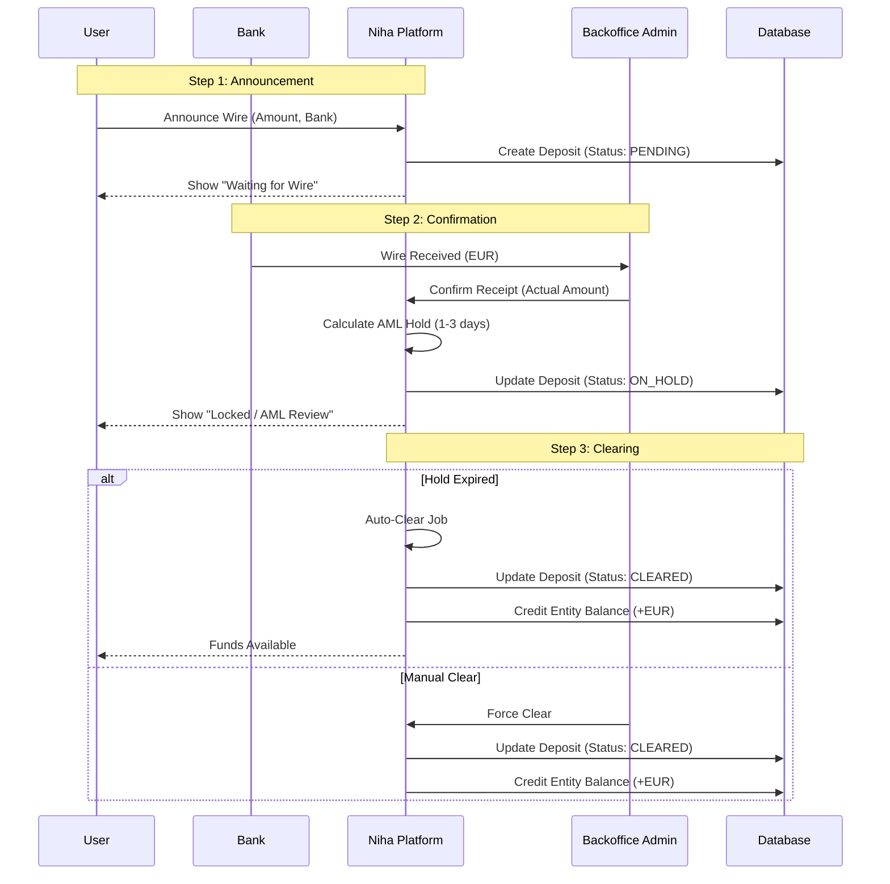
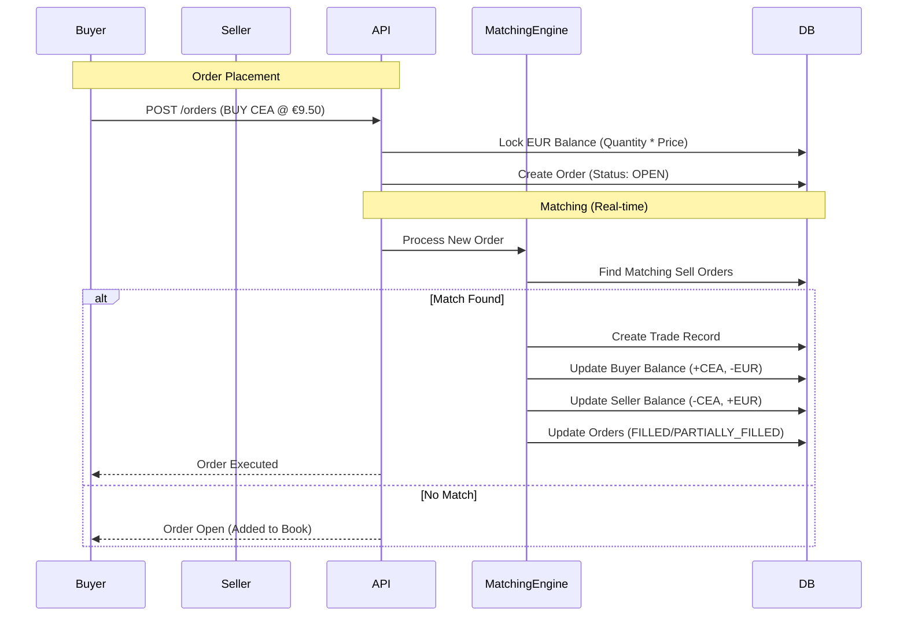
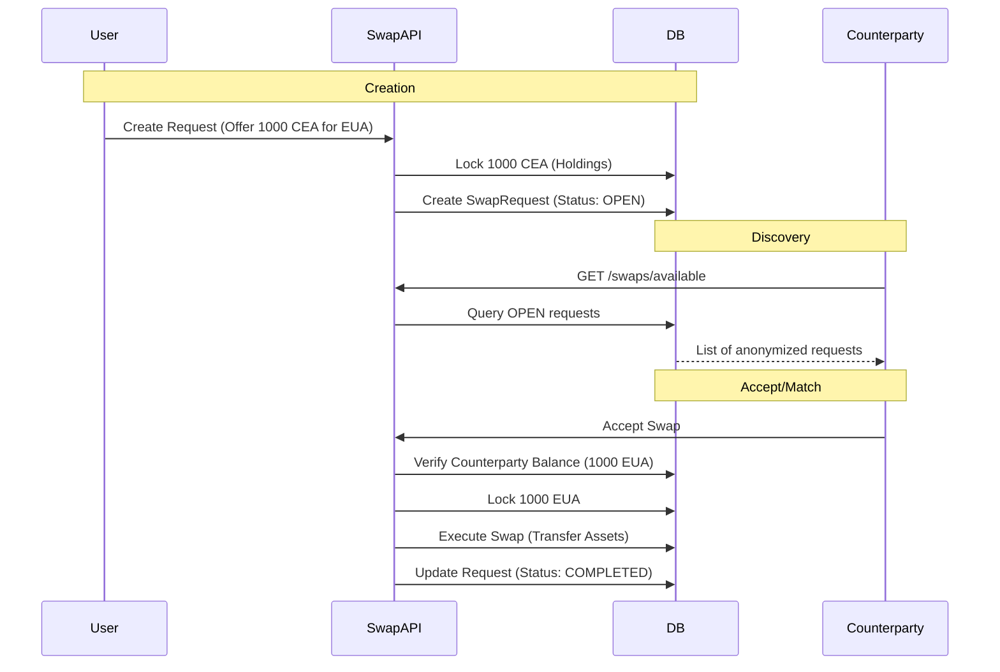
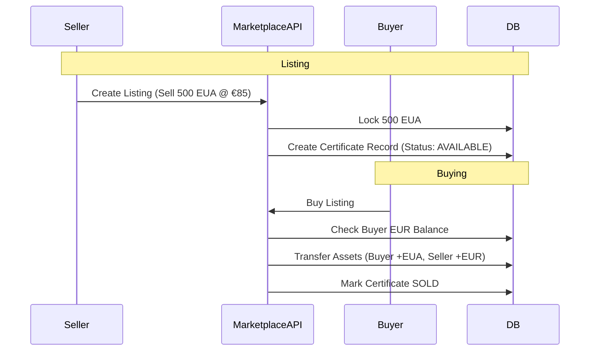

# Niha Platform Workflows

This document visualizes the core functional workflows of the Niha Platform using Mermaid diagrams. We use these to validate our implementation logic.

## 1. Fund Flows: Deposits & AML
How fiat (EUR) enters the system and becomes available balance.

## 2. Cash Market: Trading (Simulated vs Real)
How CEA/EUR is traded. *Currently migrating from Simulation to Real.*

## 3. Swap Market: CEA ↔ EUA
How users swap one certificate type for another.

## 4. Marketplace: Listings (EUA/CEA)
Direct sales of certificates (listings).

