# NIHA Carbon Platform - Workflow Diagrams

> **Document Version:** 1.0
> **Last Updated:** 2026-01-27
> **Status:** Draft - Ready for Review

---

## Table of Contents

1. [System Overview](#1-system-overview)
2. [User Onboarding Workflow](#2-user-onboarding-workflow)
3. [KYC Verification Workflow](#3-kyc-verification-workflow)
4. [Funding Workflow](#4-funding-workflow)
5. [CEA Buying Workflow (Cash Market)](#5-cea-buying-workflow-cash-market)
6. [Settlement Workflow (T+N)](#6-settlement-workflow-tn)
7. [CEA↔EUA Swap Workflow](#7-ceaeua-swap-workflow)
8. [Market Maker Workflow](#8-market-maker-workflow)
9. [Authentication Workflow](#9-authentication-workflow)
10. [Complete User Journey](#10-complete-user-journey)
11. [State Machines Reference](#11-state-machines-reference)
12. [Data Models Reference](#12-data-models-reference)

---

## 1. System Overview

### 1.1 Platform Architecture

```mermaid
flowchart TB
    subgraph External["External Systems"]
        BANK["🏦 HSBC Bank<br/>Client Money Account"]
        CEA_REG["🇨🇳 China ETS Registry<br/>CEA Certificates"]
        EUA_REG["🇪🇺 EU ETS Registry<br/>EUA Certificates"]
        EMAIL["📧 Email Service<br/>Resend"]
        SANCTIONS["🔍 Sanctions Lists<br/>OFAC / EU / UN"]
    end

    subgraph Platform["Niha Carbon Platform"]
        subgraph Frontend["Frontend Layer"]
            LANDING["Landing Page"]
            LOGIN["Login/Auth"]
            ONBOARD["Onboarding"]
            DASHBOARD["Dashboard"]
            CASH["Cash Market"]
            SWAP["Swap Market"]
            BACKOFFICE["Backoffice Admin"]
        end

        subgraph Backend["Backend Services"]
            AUTH_SVC["Auth Service"]
            KYC_SVC["KYC Service"]
            DEPOSIT_SVC["Deposit Service"]
            ORDER_SVC["Order Matching Engine"]
            SETTLE_SVC["Settlement Processor"]
            MM_SVC["Market Maker Service"]
            AUDIT_SVC["Audit/Logging Service"]
        end

        subgraph Data["Data Layer"]
            DB[(PostgreSQL)]
            REDIS[(Redis Cache)]
            FILES["File Storage<br/>KYC Documents"]
        end
    end

    subgraph Users["Users"]
        CLIENT["👤 Client<br/>Trader"]
        ADMIN["👨‍💼 Admin<br/>Backoffice"]
        MM["🤖 Market Maker<br/>AI Agent"]
    end

    CLIENT --> LANDING
    CLIENT --> LOGIN
    CLIENT --> DASHBOARD
    CLIENT --> CASH
    CLIENT --> SWAP

    ADMIN --> BACKOFFICE
    MM --> ORDER_SVC

    Frontend --> Backend
    Backend --> Data

    AUTH_SVC --> EMAIL
    DEPOSIT_SVC --> BANK
    DEPOSIT_SVC --> SANCTIONS
    SETTLE_SVC --> CEA_REG
    SETTLE_SVC --> EUA_REG
    KYC_SVC --> FILES
```

### 1.2 User Roles & Permissions

```mermaid
flowchart LR
    subgraph Roles["User Roles Progression"]
        PENDING["🔴 PENDING<br/>KYC not complete"]
        APPROVED["🟡 APPROVED<br/>KYC approved, not funded"]
        FUNDED["🟢 FUNDED<br/>Can trade"]
        ADMIN_ROLE["🔵 ADMIN<br/>Full access"]
        MM_ROLE["🟣 MARKET_MAKER<br/>Liquidity provider"]
    end

    PENDING -->|"All KYC docs approved"| APPROVED
    APPROVED -->|"Deposit cleared"| FUNDED

    subgraph Permissions["Access Permissions"]
        P1["Upload KYC docs"]
        P2["View dashboard"]
        P3["Trade on markets"]
        P4["Manage users"]
        P5["Place MM orders"]
    end

    PENDING -.-> P1
    APPROVED -.-> P1
    APPROVED -.-> P2
    FUNDED -.-> P1
    FUNDED -.-> P2
    FUNDED -.-> P3
    ADMIN_ROLE -.-> P4
    MM_ROLE -.-> P5
```

---

## 2. User Onboarding Workflow

### 2.1 Contact Submission Flow

```mermaid
sequenceDiagram
    autonumber
    participant C as 👤 Potential Client
    participant L as 🌐 Landing Page
    participant API as ⚙️ Backend API
    participant DB as 🗄️ Database
    participant E as 📧 Email Service
    participant A as 👨‍💼 Admin

    C->>L: Visit landing page
    L->>C: Display NDA form

    C->>L: Fill form (email, company, position)
    L->>API: POST /api/v1/contact

    API->>DB: Create ContactRequest
    Note over DB: status: NEW

    API->>E: Send acknowledgment email
    E->>C: "Thank you for your interest"

    API->>L: Return success
    L->>C: Show confirmation message

    Note over A: Admin notification via WebSocket

    A->>API: GET /api/v1/admin/contact-requests
    API->>DB: Fetch pending requests
    DB->>API: Return ContactRequest list
    API->>A: Display in backoffice

    A->>API: Review request
    A->>API: PUT /api/v1/admin/contact-requests/{id}
    API->>DB: Update status: CONTACTED
```

### 2.2 Account Creation Flow

```mermaid
sequenceDiagram
    autonumber
    participant A as 👨‍💼 Admin
    participant API as ⚙️ Backend API
    participant DB as 🗄️ Database
    participant E as 📧 Email Service
    participant C as 👤 New User

    A->>API: POST /api/v1/admin/users/create-from-request
    Note over API: Payload: contact_request_id, mode (manual/invitation)

    API->>DB: Create Entity record
    Note over DB: Entity with kyc_status: PENDING

    API->>DB: Create User record
    Note over DB: User with role: PENDING

    alt Manual Mode
        API->>API: Generate random password
        API->>E: Send credentials email
        E->>C: "Your account: email + password"
    else Invitation Mode
        API->>API: Generate invitation token (24h)
        API->>E: Send invitation email
        E->>C: "Set up your account: [link]"
    end

    API->>DB: Update ContactRequest status: ENROLLED
    API->>A: Return success + user details

    C->>API: Login or complete invitation
    Note over C: User can now access /onboarding
```

### 2.3 Contact Request State Machine


---

## 3. KYC Verification Workflow

### 3.1 Document Upload Flow

```mermaid
sequenceDiagram
    autonumber
    participant U as 👤 User (PENDING)
    participant FE as 🌐 Onboarding Page
    participant API as ⚙️ Backend API
    participant FS as 📁 File Storage
    participant DB as 🗄️ Database
    participant WS as 🔌 WebSocket
    participant A as 👨‍💼 Admin

    U->>FE: Navigate to /onboarding
    FE->>API: GET /api/v1/onboarding/status
    API->>DB: Fetch uploaded documents
    DB->>API: Return document list
    API->>FE: Show progress (X/7 uploaded)

    loop For each required document
        U->>FE: Select file to upload
        FE->>FE: Validate file (PDF/JPG/PNG, <10MB)
        FE->>API: POST /api/v1/onboarding/documents

        API->>FS: Save to /uploads/kyc/{user_id}/
        FS->>API: Return file path

        API->>DB: Create KYCDocument
        Note over DB: status: PENDING

        API->>WS: Broadcast "kyc_document_uploaded"
        WS->>A: Real-time notification

        API->>FE: Return success
        FE->>U: Update progress UI
    end

    U->>FE: Click "Submit for Verification"
    FE->>API: POST /api/v1/onboarding/submit
    API->>DB: Update Entity.kyc_submitted_at = NOW
    API->>FE: Confirmation
    FE->>U: "Documents submitted for review"
```

### 3.2 Required Documents

```mermaid
flowchart TB
    subgraph Company["📋 Company Documents (Required)"]
        DOC1["📄 REGISTRATION<br/>Business Registration Certificate"]
        DOC2["📄 TAX_CERTIFICATE<br/>Tax Registration Document"]
        DOC3["📄 ARTICLES<br/>Articles of Association"]
        DOC4["📄 FINANCIAL_STATEMENTS<br/>Latest Financial Statements"]
    end

    subgraph Representative["👤 Representative Documents (Required)"]
        DOC5["🪪 ID<br/>Government-issued ID"]
        DOC6["📄 PROOF_AUTHORITY<br/>Power of Attorney / Authorization"]
        DOC7["📄 CONTACT_INFO<br/>Representative Contact Details"]
    end

    subgraph Optional["📎 Optional Documents"]
        DOC8["📄 GHG_PERMIT<br/>Greenhouse Gas Permit<br/>(for EU installations)"]
    end

    Company --> SUBMIT["✅ Submit for Verification"]
    Representative --> SUBMIT
    Optional -.-> SUBMIT
```

### 3.3 Admin Review Flow

```mermaid
sequenceDiagram
    autonumber
    participant A as 👨‍💼 Admin
    participant BO as 🖥️ Backoffice
    participant API as ⚙️ Backend API
    participant DB as 🗄️ Database
    participant E as 📧 Email Service
    participant U as 👤 User

    A->>BO: Navigate to /backoffice
    BO->>API: GET /api/v1/backoffice/pending-users
    API->>DB: Fetch users with role=PENDING
    DB->>API: Return user list with doc counts
    API->>BO: Display pending users

    A->>BO: Select user to review
    BO->>API: GET /api/v1/backoffice/users/{id}
    API->>DB: Fetch user details + documents
    DB->>API: Return full profile
    API->>BO: Display documents for review

    loop For each document
        A->>BO: View document
        BO->>API: GET /api/v1/onboarding/documents/{id}/download
        API->>A: Return document file

        alt Document Valid
            A->>BO: Click "Approve"
            BO->>API: PUT /api/v1/backoffice/kyc-documents/{id}/review
            Note over API: status: APPROVED, notes: optional
            API->>DB: Update KYCDocument.status = APPROVED
        else Document Invalid
            A->>BO: Click "Reject" + add notes
            BO->>API: PUT /api/v1/backoffice/kyc-documents/{id}/review
            Note over API: status: REJECTED, notes: "reason..."
            API->>DB: Update KYCDocument.status = REJECTED
            API->>E: Send rejection email
            E->>U: "Document rejected: [reason]"
        end
    end

    API->>API: Check if all documents approved

    alt All Documents Approved
        API->>DB: Update Entity.kyc_status = APPROVED
        API->>DB: Update Entity.kyc_approved_at = NOW
        API->>DB: Update Entity.kyc_approved_by = admin_id
        API->>DB: Update User.role = APPROVED
        API->>E: Send approval email
        E->>U: "KYC Approved! Next: Fund your account"
    end
```

### 3.4 KYC Document State Machine


### 3.5 Entity KYC State Machine


---

## 4. Funding Workflow

### 4.1 Deposit Flow

```mermaid
sequenceDiagram
    autonumber
    participant U as 👤 User (APPROVED)
    participant FE as 🌐 Funding Page
    participant API as ⚙️ Backend API
    participant DB as 🗄️ Database
    participant BANK as 🏦 HSBC Bank
    participant AML as 🔍 AML Screening
    participant A as 👨‍💼 Admin
    participant E as 📧 Email Service

    U->>FE: Navigate to /funding
    FE->>API: GET /api/v1/funding/instructions
    API->>FE: Return bank details + reference

    Note over FE: Display wire instructions:<br/>Bank: HSBC<br/>Account: XXX<br/>Reference: DEP-{entity_id}

    U->>BANK: Initiate wire transfer
    Note over BANK: 1-3 business days

    U->>FE: Report deposit (amount, date)
    FE->>API: POST /api/v1/funding/report-deposit
    API->>DB: Create Deposit (status: PENDING)
    API->>FE: Confirmation

    BANK->>A: Wire received notification

    A->>API: GET /api/v1/backoffice/deposits
    API->>DB: Fetch pending deposits
    DB->>API: Return deposit list

    A->>API: PUT /api/v1/backoffice/deposits/{id}/confirm
    Note over API: confirmed_amount, wire_reference
    API->>DB: Update Deposit (status: CONFIRMED)

    API->>AML: Initiate sanctions screening
    Note over AML: OFAC, EU, UN lists<br/>1-2 business days

    alt Screening PASS
        AML->>API: Clear result
        API->>DB: Update Deposit (status: CLEARED)
        API->>DB: Update Entity.balance_amount += amount
        API->>DB: Update User.role = FUNDED
        API->>E: Send confirmation
        E->>U: "Funds cleared! Start trading"
    else Screening FAIL
        AML->>API: Match found
        API->>DB: Update Deposit (status: HELD)
        API->>A: Escalate to compliance
        API->>E: Send notification
        E->>U: "Deposit under review"
    end
```

### 4.2 Deposit State Machine


### 4.3 AML Hold Process


---

## 5. CEA Buying Workflow (Cash Market)

### 5.1 Order Book Structure

```mermaid
flowchart TB
    subgraph OrderBook["📊 Order Book - CEA/EUR"]
        subgraph Asks["ASKS (Sellers) - Sorted Price ASC"]
            ASK3["€85.20 | 500 CEA | 3 orders"]
            ASK2["€85.15 | 300 CEA | 2 orders"]
            ASK1["€85.10 | 200 CEA | 1 order ← Best Ask"]
        end

        subgraph Spread["SPREAD"]
            SP["€0.05 (0.06%)"]
        end

        subgraph Bids["BIDS (Buyers) - Sorted Price DESC"]
            BID1["€85.05 | 150 CEA | 2 orders ← Best Bid"]
            BID2["€85.00 | 400 CEA | 3 orders"]
            BID3["€84.95 | 250 CEA | 1 order"]
        end
    end

    subgraph Providers["Order Providers"]
        MM["🤖 Market Makers<br/>(Liquidity)"]
        USERS["👤 Other Users<br/>(Limit Orders)"]
    end

    MM --> Asks
    MM --> Bids
    USERS --> Asks
    USERS --> Bids
```

### 5.2 Buy Order Flow

```mermaid
sequenceDiagram
    autonumber
    participant U as 👤 User (FUNDED)
    participant FE as 🌐 Cash Market Page
    participant API as ⚙️ Backend API
    participant ME as ⚡ Matching Engine
    participant DB as 🗄️ Database
    participant E as 📧 Email Service

    U->>FE: Navigate to /cash-market
    FE->>API: GET /api/v1/cash-market/orderbook
    API->>DB: Fetch open orders (bids + asks)
    DB->>API: Return order book
    API->>FE: Display order book

    U->>FE: Enter amount (EUR) or click MAX
    FE->>FE: Debounce 500ms
    FE->>API: GET /api/v1/cash-market/preview
    Note over API: amount_eur: 8500

    API->>ME: Calculate fills (FIFO)
    ME->>API: Return preview
    Note over API: fills: [{price: 85.10, qty: 50}, {price: 85.15, qty: 50}]<br/>avg_price: 85.125<br/>fee: 42.50 (0.5%)<br/>total: 8542.50

    API->>FE: Display preview
    FE->>U: Show order summary

    U->>FE: Click "Buy CEA"
    FE->>API: POST /api/v1/cash-market/buy
    Note over API: amount_eur: 8500

    API->>API: Validate balance >= total
    API->>ME: Execute market order

    loop For each fill (FIFO order)
        ME->>DB: Get sell order
        ME->>DB: Create CashMarketTrade
        ME->>DB: Update sell order filled_quantity
        ME->>DB: Transfer EUR: buyer → seller
        ME->>DB: Transfer CEA: seller → buyer
        ME->>DB: Create AssetTransaction (buyer)
        ME->>DB: Create AssetTransaction (seller)
    end

    ME->>DB: Create SettlementBatch (T+3)
    ME->>API: Return execution result

    API->>E: Send confirmation email
    E->>U: "Order confirmed: 100 CEA @ €85.125"

    API->>FE: Return success + order details
    FE->>U: Show confirmation modal
```

### 5.3 Order Matching Logic (FIFO)

```mermaid
flowchart TB
    subgraph Input["Market Buy Order"]
        ORDER["Buy Order<br/>Amount: €8,500 EUR<br/>Type: MARKET"]
    end

    subgraph OrderBook["Available Sell Orders (ASK)"]
        direction TB
        O1["Order #1 (oldest)<br/>Price: €85.10<br/>Available: 50 CEA<br/>Value: €4,255"]
        O2["Order #2<br/>Price: €85.15<br/>Available: 100 CEA<br/>Value: €8,515"]
        O3["Order #3<br/>Price: €85.20<br/>Available: 200 CEA<br/>Value: €17,040"]
    end

    subgraph Matching["⚡ Matching Process"]
        M1["Fill #1: 50 CEA @ €85.10<br/>Spent: €4,255<br/>Remaining: €4,245"]
        M2["Fill #2: 49.85 CEA @ €85.15<br/>Spent: €4,244.78<br/>Remaining: €0.22"]
    end

    subgraph Result["Execution Result"]
        R1["Total CEA: 99.85<br/>Total EUR: €8,499.78<br/>Avg Price: €85.125<br/>Fee (0.5%): €42.50<br/>Grand Total: €8,542.28"]
    end

    ORDER --> O1
    O1 -->|"Fully filled"| M1
    M1 --> O2
    O2 -->|"Partially filled"| M2
    M2 --> Result
```

### 5.4 Order State Machine


### 5.5 Fee Calculation

```mermaid
flowchart LR
    subgraph Input["Order Input"]
        AMT["Amount: €8,500"]
    end

    subgraph Calc["Fee Calculation"]
        RATE["Platform Fee: 0.5%"]
        FEE["Fee = €8,500 × 0.005<br/>= €42.50"]
    end

    subgraph Output["Final Cost"]
        TOTAL["CEA Value: €8,500<br/>Platform Fee: €42.50<br/>─────────────<br/>Total: €8,542.50"]
    end

    AMT --> RATE
    RATE --> FEE
    FEE --> TOTAL
```

---

## 6. Settlement Workflow (T+N)

### 6.1 Settlement Timeline (CEA = T+3)


### 6.2 Settlement Processing Flow

```mermaid
sequenceDiagram
    autonumber
    participant ME as ⚡ Matching Engine
    participant API as ⚙️ Settlement Service
    participant DB as 🗄️ Database
    participant CRON as ⏰ Hourly Processor
    participant REG as 🇨🇳 China ETS Registry
    participant E as 📧 Email Service
    participant U as 👤 User

    ME->>API: Create settlement batch
    Note over ME: After trade execution

    API->>DB: Create SettlementBatch
    Note over DB: status: PENDING<br/>expected_date: T+3<br/>ref: SET-2026-000123

    API->>DB: Create SettlementStatusHistory
    Note over DB: status: PENDING<br/>notes: "Settlement created"

    API->>E: Send confirmation
    E->>U: "Order confirmed, settlement T+3"

    Note over CRON: Runs every hour

    loop Every hour
        CRON->>DB: Find settlements ready for status change

        alt T+1 reached
            CRON->>DB: Update status: TRANSFER_INITIATED
            CRON->>REG: Initiate registry transfer
            CRON->>DB: Create StatusHistory
            CRON->>E: Send update
            E->>U: "Transfer initiated"
        end

        alt T+2 reached
            CRON->>DB: Update status: IN_TRANSIT
            CRON->>DB: Create StatusHistory
            CRON->>E: Send update
            E->>U: "Certificates in transit"
        end

        alt T+3 reached
            REG->>CRON: Transfer complete
            CRON->>DB: Update status: AT_CUSTODY
            CRON->>DB: Update status: SETTLED
            CRON->>DB: Set actual_settlement_date = NOW
            CRON->>DB: Create StatusHistory
            CRON->>E: Send completion
            E->>U: "CEA delivered! Ready to swap"
        end
    end
```

### 6.3 Settlement State Machine

```mermaid
stateDiagram-v2
    [*] --> PENDING: Trade executed (T+0)

    PENDING --> TRANSFER_INITIATED: T+1 processor
    TRANSFER_INITIATED --> IN_TRANSIT: T+2 processor
    IN_TRANSIT --> AT_CUSTODY: T+3 processor
    AT_CUSTODY --> SETTLED: Confirmation received

    PENDING --> FAILED: Error occurred
    TRANSFER_INITIATED --> FAILED: Transfer error
    IN_TRANSIT --> FAILED: Registry error
    AT_CUSTODY --> FAILED: Custody error

    FAILED --> PENDING: Manual retry

    SETTLED --> [*]: Complete

    note right of PENDING
        T+0: Trade just executed
        Settlement batch created
    end note

    note right of TRANSFER_INITIATED
        T+1: Transfer to registry
        has been initiated
    end note

    note right of IN_TRANSIT
        T+2: Certificates being
        processed by registry
    end note

    note right of SETTLED
        T+3: CEA in user's account
        Available for swap
    end note
```

### 6.4 Settlement Types Comparison

```mermaid
flowchart TB
    subgraph CEA["CEA Settlement (T+3)"]
        CEA_T0["T+0: Trade executed"]
        CEA_T1["T+1: Transfer initiated"]
        CEA_T2["T+2: In transit"]
        CEA_T3["T+3: Settled"]

        CEA_T0 --> CEA_T1 --> CEA_T2 --> CEA_T3
    end

    subgraph EUA["EUA Settlement (T+5)"]
        EUA_T0["T+0: Trade executed"]
        EUA_T1["T+1: Transfer initiated"]
        EUA_T2["T+2: Registry processing"]
        EUA_T3["T+3: In transit"]
        EUA_T4["T+4: At custody"]
        EUA_T5["T+5: Settled"]

        EUA_T0 --> EUA_T1 --> EUA_T2 --> EUA_T3 --> EUA_T4 --> EUA_T5
    end

    subgraph Registry["External Registries"]
        CHINA["🇨🇳 China ETS<br/>CEA Registry"]
        EU["🇪🇺 EU ETS<br/>EUA Registry"]
    end

    CEA --> CHINA
    EUA --> EU
```

---

## 7. CEA↔EUA Swap Workflow

### 7.1 Swap Order Book

```mermaid
flowchart TB
    subgraph SwapBook["📊 Swap Order Book"]
        subgraph CEA_EUA["CEA → EUA Offers"]
            S1["Rate: 11.2 EUA/CEA | 500 CEA available"]
            S2["Rate: 11.3 EUA/CEA | 300 CEA available"]
            S3["Rate: 11.5 EUA/CEA | 1000 CEA available"]
        end

        subgraph EUA_CEA["EUA → CEA Offers"]
            B1["Rate: 11.0 EUA/CEA | 200 CEA equivalent"]
            B2["Rate: 10.8 EUA/CEA | 400 CEA equivalent"]
        end
    end

    subgraph Explanation["Rate Explanation"]
        EX["1 CEA = 11.2 EUA<br/>If you swap 100 CEA:<br/>You receive: 1,120 EUA"]
    end
```

### 7.2 Swap Execution Flow

```mermaid
sequenceDiagram
    autonumber
    participant A as 👤 User A (has CEA)
    participant FE as 🌐 Swap Page
    participant API as ⚙️ Backend API
    participant ME as ⚡ Swap Matcher
    participant DB as 🗄️ Database
    participant B as 👤 User B / MM (has EUA)
    participant E as 📧 Email Service

    A->>FE: Navigate to /swap
    FE->>API: GET /api/v1/swaps/offers
    API->>DB: Fetch available swap offers
    DB->>API: Return offers with rates
    API->>FE: Display swap rates

    A->>FE: Enter swap request
    Note over FE: From: 100 CEA<br/>To: EUA<br/>Min Rate: 11.0

    FE->>API: POST /api/v1/swaps/create
    API->>DB: Create SwapRequest (status: OPEN)
    API->>DB: Lock 100 CEA (TRADE_DEBIT)
    API->>FE: Confirmation

    Note over ME: Matching engine runs

    ME->>DB: Find matching counter-swap
    Note over ME: User B has EUA→CEA @ rate 11.2

    ME->>ME: Validate rates compatible
    Note over ME: A wants ≥11.0, B offers 11.2 ✓

    ME->>DB: Update both SwapRequests: MATCHED

    ME->>DB: Execute swap
    Note over DB: User A: CEA -100, EUA +1120<br/>User B: EUA -1120, CEA +100

    ME->>DB: Create SettlementBatch (CEA leg, T+3)
    ME->>DB: Create SettlementBatch (EUA leg, T+5)

    ME->>DB: Update SwapRequests: COMPLETED

    API->>E: Send confirmation to both
    E->>A: "Swap completed: 100 CEA → 1120 EUA"
    E->>B: "Swap completed: 1120 EUA → 100 CEA"
```

### 7.3 Swap State Machine

```mermaid
stateDiagram-v2
    [*] --> OPEN: Swap request created

    OPEN --> MATCHED: Counter-party found
    OPEN --> CANCELLED: User cancels
    OPEN --> EXPIRED: Timeout reached

    MATCHED --> COMPLETED: Both settlements done
    MATCHED --> FAILED: Settlement failed

    FAILED --> OPEN: Retry enabled

    COMPLETED --> [*]: Swap finalized
    CANCELLED --> [*]: Assets released
    EXPIRED --> [*]: Assets released

    note right of OPEN
        Assets locked (TRADE_DEBIT)
        Waiting for match
    end note

    note right of MATCHED
        Counter-party found
        Dual settlement in progress
    end note

    note right of COMPLETED
        CEA leg: T+3
        EUA leg: T+5
    end note
```

### 7.4 Swap Settlement Dual-Track

```mermaid
flowchart TB
    subgraph Swap["Swap Executed"]
        EXEC["User A: 100 CEA → 1120 EUA<br/>User B: 1120 EUA → 100 CEA"]
    end

    subgraph CEA_Track["CEA Settlement Track (T+3)"]
        CEA_S1["T+0: Batch created"]
        CEA_S2["T+1: Transfer initiated"]
        CEA_S3["T+2: In transit"]
        CEA_S4["T+3: CEA delivered to User B"]

        CEA_S1 --> CEA_S2 --> CEA_S3 --> CEA_S4
    end

    subgraph EUA_Track["EUA Settlement Track (T+5)"]
        EUA_S1["T+0: Batch created"]
        EUA_S2["T+1: Transfer initiated"]
        EUA_S3["T+2-T+4: EU registry processing"]
        EUA_S4["T+5: EUA delivered to User A"]

        EUA_S1 --> EUA_S2 --> EUA_S3 --> EUA_S4
    end

    Swap --> CEA_Track
    Swap --> EUA_Track

    CEA_S4 --> DONE["✅ Swap Complete"]
    EUA_S4 --> DONE
```

---

## 8. Market Maker Workflow

### 8.1 Market Maker Types

```mermaid
flowchart TB
    subgraph Types["Market Maker Types"]
        CEA_SELLER["🟢 CEA_CASH_SELLER<br/>─────────────<br/>Holds: CEA<br/>Sells: CEA for EUR<br/>Market: Cash Market"]

        CASH_BUYER["🔵 CASH_BUYER<br/>─────────────<br/>Holds: EUR<br/>Buys: CEA with EUR<br/>Market: Cash Market"]

        SWAP_MAKER["🟣 SWAP_MAKER<br/>─────────────<br/>Holds: CEA + EUA<br/>Provides: Swap liquidity<br/>Market: Swap Market"]
    end

    subgraph Purpose["Purpose"]
        LIQ["💧 Provide Liquidity<br/>Ensure market depth"]
        SPREAD["📊 Maintain Spreads<br/>Competitive pricing"]
        AVAIL["24/7 Availability<br/>Always-on trading"]
    end

    Types --> Purpose
```

### 8.2 Market Maker Creation Flow

```mermaid
sequenceDiagram
    autonumber
    participant A as 👨‍💼 Admin
    participant BO as 🖥️ Backoffice
    participant API as ⚙️ Backend API
    participant DB as 🗄️ Database

    A->>BO: Navigate to /backoffice/market-makers
    BO->>API: GET /api/v1/market-makers
    API->>DB: Fetch existing market makers
    DB->>API: Return MM list
    API->>BO: Display list

    A->>BO: Click "Create Market Maker"
    BO->>A: Show creation form

    A->>BO: Fill form
    Note over BO: name: "MM-Alpha"<br/>type: CEA_CASH_SELLER<br/>initial_cea: 10000<br/>initial_eur: 500000

    A->>BO: Submit
    BO->>API: POST /api/v1/market-makers

    API->>DB: Create User (role: MARKET_MAKER)
    API->>DB: Create MarketMakerClient
    API->>DB: Create EntityHolding (CEA: 10000)
    API->>DB: Create EntityHolding (EUR: 500000)
    API->>DB: Create TicketLog (MM_CREATED)

    API->>BO: Return success
    BO->>A: Show confirmation
```

### 8.3 Place Market Maker Order Flow

```mermaid
sequenceDiagram
    autonumber
    participant A as 👨‍💼 Admin
    participant BO as 🖥️ Order Book Page
    participant API as ⚙️ Backend API
    participant DB as 🗄️ Database
    participant OB as 📊 Order Book

    A->>BO: Navigate to /backoffice/order-book
    BO->>API: GET /api/v1/cash-market/orderbook
    API->>DB: Fetch order book
    DB->>API: Return bids + asks
    API->>BO: Display order book

    A->>BO: Select certificate type (CEA)
    A->>BO: Click "Place ASK"
    BO->>A: Show order modal

    A->>BO: Select Market Maker
    BO->>API: GET /api/v1/market-makers/{id}/balances
    API->>DB: Fetch MM balances
    DB->>API: Return balances
    API->>BO: Display: CEA: 10000, EUR: 500000

    A->>BO: Enter price and quantity
    Note over BO: Price: €85.10<br/>Quantity: 500 CEA<br/>Total: €42,550

    A->>BO: Click "Place Order"
    BO->>API: POST /api/v1/admin/market-orders

    API->>API: Validate CEA balance >= 500
    API->>DB: Lock CEA (TRADE_DEBIT: 500)
    API->>DB: Create Order (market_maker_id, SELL, 85.10, 500)
    API->>DB: Create TicketLog (ORDER_PLACED)

    API->>BO: Return success
    BO->>OB: Refresh order book
    Note over OB: New ASK visible at €85.10
```

### 8.4 Market Maker Order Lifecycle

```mermaid
flowchart TB
    subgraph Admin["Admin Actions"]
        CREATE["Create MM Order<br/>ASK: 500 CEA @ €85.10"]
    end

    subgraph System["System Processing"]
        VALIDATE["Validate MM Balance<br/>CEA: 10000 ≥ 500 ✓"]
        LOCK["Lock Assets<br/>TRADE_DEBIT: 500 CEA"]
        ORDER["Create Order<br/>status: OPEN"]
        BOOK["Add to Order Book<br/>Visible to all users"]
    end

    subgraph User["User Trading"]
        USER_BUY["User buys 500 CEA<br/>Market order"]
        MATCH["Matching Engine<br/>FIFO match"]
        TRADE["CashMarketTrade created"]
    end

    subgraph Settlement["Post-Trade"]
        TRANSFER["EUR → MM<br/>CEA → User"]
        SETTLE["Settlement T+3"]
    end

    CREATE --> VALIDATE --> LOCK --> ORDER --> BOOK
    BOOK --> USER_BUY --> MATCH --> TRADE --> TRANSFER --> SETTLE
```

---

## 9. Authentication Workflow

### 9.1 Magic Link Flow

```mermaid
sequenceDiagram
    autonumber
    participant U as 👤 User
    participant FE as 🌐 Login Page
    participant API as ⚙️ Auth Service
    participant REDIS as 🔴 Redis
    participant DB as 🗄️ Database
    participant E as 📧 Email Service

    U->>FE: Navigate to /login
    FE->>U: Show login form

    U->>FE: Enter email
    U->>FE: Click "Send Magic Link"
    FE->>API: POST /api/v1/auth/magic-link

    API->>DB: Check user exists
    DB->>API: User found

    API->>API: Generate token (UUID)
    API->>REDIS: Store token (15 min TTL)
    Note over REDIS: key: magic_link:{token}<br/>value: {email, user_id}

    API->>E: Send magic link email
    E->>U: Email with login link

    API->>FE: "Check your email"

    U->>E: Click link in email
    E->>FE: Redirect to /auth/verify?token=XXX

    FE->>API: POST /api/v1/auth/verify-magic-link
    Note over API: token: XXX

    API->>REDIS: Get token data
    REDIS->>API: Return {email, user_id}

    API->>REDIS: Delete token (one-time use)

    API->>DB: Update User.last_login
    API->>DB: Create AuthenticationAttempt (SUCCESS)

    API->>API: Generate JWT access token
    API->>FE: Return JWT + user data

    FE->>FE: Store token
    FE->>U: Redirect to dashboard
```

### 9.2 Password Login Flow

```mermaid
sequenceDiagram
    autonumber
    participant U as 👤 User
    participant FE as 🌐 Login Page
    participant API as ⚙️ Auth Service
    participant DB as 🗄️ Database

    U->>FE: Enter email + password
    U->>FE: Click "Login"
    FE->>API: POST /api/v1/auth/login

    API->>DB: Find user by email

    alt User not found
        API->>DB: Log AuthenticationAttempt (FAILED, "user_not_found")
        API->>FE: 401 Unauthorized
        FE->>U: "Invalid credentials"
    else User found
        API->>API: Verify password hash

        alt Password invalid
            API->>DB: Log AuthenticationAttempt (FAILED, "invalid_password")
            API->>FE: 401 Unauthorized
            FE->>U: "Invalid credentials"
        else Password valid
            API->>DB: Update User.last_login
            API->>DB: Log AuthenticationAttempt (SUCCESS)
            API->>API: Generate JWT access token
            API->>FE: Return JWT + user data
            FE->>FE: Store token
            FE->>U: Redirect to dashboard
        end
    end
```

### 9.3 Invitation Setup Flow

```mermaid
sequenceDiagram
    autonumber
    participant A as 👨‍💼 Admin
    participant API as ⚙️ Backend
    participant DB as 🗄️ Database
    participant E as 📧 Email
    participant U as 👤 New User
    participant FE as 🌐 Setup Page

    A->>API: Create user (invitation mode)
    API->>API: Generate invitation token (24h)
    API->>DB: Store token with user
    API->>E: Send invitation email
    E->>U: "Set up your account: [link]"

    U->>FE: Click invitation link
    FE->>API: GET /api/v1/auth/validate-invitation?token=XXX
    API->>DB: Validate token (exists, not expired)

    alt Token valid
        API->>FE: Show password setup form
        U->>FE: Enter new password
        Note over FE: Password requirements:<br/>8+ chars, upper, lower,<br/>number, special char

        FE->>API: POST /api/v1/auth/complete-invitation
        API->>API: Validate password strength
        API->>DB: Hash and store password
        API->>DB: Clear invitation token
        API->>DB: Activate user
        API->>API: Generate JWT
        API->>FE: Return JWT + user data
        FE->>U: Redirect to onboarding
    else Token invalid/expired
        API->>FE: 400 Bad Request
        FE->>U: "Link expired, contact admin"
    end
```

### 9.4 Password Requirements

```mermaid
flowchart TB
    subgraph Requirements["Password Requirements"]
        R1["✓ Minimum 8 characters"]
        R2["✓ At least 1 UPPERCASE letter (A-Z)"]
        R3["✓ At least 1 lowercase letter (a-z)"]
        R4["✓ At least 1 number (0-9)"]
        R5["✓ At least 1 special character<br/>!@#$%^&*()_+-=[]{}|;:,.<>?"]
    end

    subgraph Example["Examples"]
        GOOD["✅ Valid: MyP@ssw0rd!"]
        BAD1["❌ Invalid: password (no upper, number, special)"]
        BAD2["❌ Invalid: PASSWORD1 (no lower, special)"]
        BAD3["❌ Invalid: Pass1! (too short)"]
    end
```

---

## 10. Complete User Journey

### 10.1 End-to-End Flow

```mermaid
flowchart TB
    subgraph Week1["Week 1: Onboarding"]
        L["🌐 Landing Page<br/>Submit NDA"]
        C["📧 Contact Created<br/>status: NEW"]
        A1["👨‍💼 Admin Reviews"]
        U["👤 Account Created<br/>role: PENDING"]
    end

    subgraph Week2["Week 2: KYC"]
        K1["📄 Upload 7 Documents"]
        K2["📤 Submit for Review"]
        K3["👨‍💼 Admin Reviews Each"]
        K4["✅ KYC Approved<br/>role: APPROVED"]
    end

    subgraph Week3["Week 3: Funding"]
        F1["🏦 Wire Transfer<br/>to Niha bank"]
        F2["👨‍💼 Admin Confirms"]
        F3["🔍 AML Hold (1-2 days)"]
        F4["💰 Funds Cleared<br/>role: FUNDED"]
    end

    subgraph Week4["Week 4+: Trading"]
        T1["📊 View Cash Market"]
        T2["🛒 Buy CEA"]
        T3["⏳ Settlement T+3"]
        T4["💎 CEA Received"]
    end

    subgraph Week5["Week 5+: Swap"]
        S1["🔄 Swap CEA→EUA"]
        S2["⏳ Dual Settlement<br/>CEA: T+3, EUA: T+5"]
        S3["🇪🇺 EUA Received<br/>EU ETS Compliant"]
    end

    L --> C --> A1 --> U
    U --> K1 --> K2 --> K3 --> K4
    K4 --> F1 --> F2 --> F3 --> F4
    F4 --> T1 --> T2 --> T3 --> T4
    T4 --> S1 --> S2 --> S3
```

### 10.2 User Role Progression

```mermaid
stateDiagram-v2
    [*] --> NONE: Potential client

    NONE --> PENDING: Account created

    PENDING --> APPROVED: KYC approved

    APPROVED --> FUNDED: Deposit cleared

    FUNDED --> FUNDED: Trading active

    note right of NONE
        Can: View landing, submit NDA
        Cannot: Access platform
    end note

    note right of PENDING
        Can: Upload KYC docs
        Cannot: Trade, view balances
    end note

    note right of APPROVED
        Can: View dashboard preview
        Cannot: Trade (no funds)
    end note

    note right of FUNDED
        Can: Full trading access
        Buy CEA, Swap to EUA
    end note
```

### 10.3 Timeline Summary

```mermaid
gantt
    title Complete User Journey Timeline
    dateFormat  YYYY-MM-DD

    section Onboarding
    Submit NDA              :done, onb1, 2026-01-01, 1d
    Admin review            :done, onb2, 2026-01-02, 2d
    Account created         :done, onb3, 2026-01-04, 1d

    section KYC
    Upload documents        :active, kyc1, 2026-01-05, 3d
    Submit for review       :kyc2, 2026-01-08, 1d
    Admin review            :kyc3, 2026-01-09, 3d
    KYC approved            :milestone, kyc4, 2026-01-12, 0d

    section Funding
    Wire transfer           :fund1, 2026-01-12, 3d
    Admin confirms          :fund2, 2026-01-15, 1d
    AML hold                :fund3, 2026-01-16, 2d
    Funds cleared           :milestone, fund4, 2026-01-18, 0d

    section Trading
    Buy CEA                 :trade1, 2026-01-18, 1d
    Settlement T+3          :trade2, 2026-01-19, 3d
    CEA received            :milestone, trade3, 2026-01-22, 0d

    section Swap
    Swap CEA to EUA         :swap1, 2026-01-22, 1d
    Settlement T+5          :swap2, 2026-01-23, 5d
    EUA received            :milestone, swap3, 2026-01-28, 0d
```

---

## 11. State Machines Reference

### 11.1 All Status Enums

```mermaid
flowchart TB
    subgraph Contact["ContactStatus"]
        C_NEW["NEW"]
        C_CONT["CONTACTED"]
        C_ENR["ENROLLED"]
        C_REJ["REJECTED"]

        C_NEW --> C_CONT
        C_CONT --> C_ENR
        C_CONT --> C_REJ
    end

    subgraph Doc["DocumentStatus"]
        D_PEND["PENDING"]
        D_APP["APPROVED"]
        D_REJ["REJECTED"]

        D_PEND --> D_APP
        D_PEND --> D_REJ
        D_REJ --> D_PEND
    end

    subgraph KYC["KYCStatus"]
        K_PEND["PENDING"]
        K_APP["APPROVED"]
        K_REJ["REJECTED"]

        K_PEND --> K_APP
        K_PEND --> K_REJ
    end

    subgraph Deposit["DepositStatus"]
        DEP_PEND["PENDING"]
        DEP_CONF["CONFIRMED"]
        DEP_CLEAR["CLEARED"]
        DEP_HELD["HELD"]
        DEP_REJ["REJECTED"]

        DEP_PEND --> DEP_CONF
        DEP_CONF --> DEP_CLEAR
        DEP_CONF --> DEP_HELD
        DEP_HELD --> DEP_CLEAR
        DEP_HELD --> DEP_REJ
    end

    subgraph Order["OrderStatus"]
        O_OPEN["OPEN"]
        O_PART["PARTIALLY_FILLED"]
        O_FILL["FILLED"]
        O_CANC["CANCELLED"]

        O_OPEN --> O_PART
        O_OPEN --> O_FILL
        O_OPEN --> O_CANC
        O_PART --> O_FILL
        O_PART --> O_CANC
    end

    subgraph Settle["SettlementStatus"]
        S_PEND["PENDING"]
        S_INIT["TRANSFER_INITIATED"]
        S_TRAN["IN_TRANSIT"]
        S_CUST["AT_CUSTODY"]
        S_DONE["SETTLED"]
        S_FAIL["FAILED"]

        S_PEND --> S_INIT
        S_INIT --> S_TRAN
        S_TRAN --> S_CUST
        S_CUST --> S_DONE
        S_PEND --> S_FAIL
        S_INIT --> S_FAIL
        S_TRAN --> S_FAIL
    end

    subgraph Swap["SwapStatus"]
        SW_OPEN["OPEN"]
        SW_MATCH["MATCHED"]
        SW_COMP["COMPLETED"]
        SW_CANC["CANCELLED"]
        SW_EXP["EXPIRED"]

        SW_OPEN --> SW_MATCH
        SW_OPEN --> SW_CANC
        SW_OPEN --> SW_EXP
        SW_MATCH --> SW_COMP
    end
```

---

## 12. Data Models Reference

### 12.1 Core Entities

```mermaid
erDiagram
    User ||--o{ Entity : "belongs_to"
    User ||--o{ AuthenticationAttempt : "has_many"
    User ||--o{ KYCDocument : "uploads"

    Entity ||--o{ Deposit : "has_many"
    Entity ||--o{ EntityHolding : "has_many"
    Entity ||--o{ Order : "places"
    Entity ||--o{ SwapRequest : "creates"

    MarketMakerClient ||--|| User : "extends"
    MarketMakerClient ||--o{ Order : "places"

    Order ||--o{ CashMarketTrade : "generates"
    CashMarketTrade ||--|| SettlementBatch : "creates"

    User {
        uuid id PK
        string email UK
        string password_hash
        enum role "PENDING|APPROVED|FUNDED|ADMIN|MARKET_MAKER"
        uuid entity_id FK
        datetime last_login
        datetime created_at
    }

    Entity {
        uuid id PK
        string name
        string registration_number
        enum kyc_status "PENDING|APPROVED|REJECTED"
        datetime kyc_submitted_at
        datetime kyc_approved_at
        uuid kyc_approved_by FK
        decimal balance_amount
        enum balance_currency
        decimal total_deposited
    }

    KYCDocument {
        uuid id PK
        uuid user_id FK
        uuid entity_id FK
        enum document_type
        string file_path
        enum status "PENDING|APPROVED|REJECTED"
        string review_notes
        datetime reviewed_at
        uuid reviewed_by FK
    }

    Deposit {
        uuid id PK
        uuid entity_id FK
        decimal amount
        enum currency
        string wire_reference
        enum status "PENDING|CONFIRMED|CLEARED|HELD|REJECTED"
        datetime confirmed_at
        uuid confirmed_by FK
    }
```

### 12.2 Trading Entities

```mermaid
erDiagram
    Order ||--o{ CashMarketTrade : "buyer_order"
    Order ||--o{ CashMarketTrade : "seller_order"
    CashMarketTrade ||--|| SettlementBatch : "triggers"
    SettlementBatch ||--o{ SettlementStatusHistory : "has_many"

    Order {
        uuid id PK
        enum market "CEA_CASH|SWAP"
        uuid entity_id FK
        uuid market_maker_id FK
        enum certificate_type "CEA|EUA"
        enum side "BUY|SELL"
        decimal price
        decimal quantity
        decimal filled_quantity
        enum status "OPEN|PARTIALLY_FILLED|FILLED|CANCELLED"
        datetime created_at
    }

    CashMarketTrade {
        uuid id PK
        uuid buy_order_id FK
        uuid sell_order_id FK
        uuid market_maker_id FK
        enum certificate_type
        decimal price
        decimal quantity
        datetime executed_at
    }

    SettlementBatch {
        uuid id PK
        string batch_reference UK
        uuid entity_id FK
        uuid order_id FK
        uuid trade_id FK
        enum settlement_type
        enum status
        enum asset_type
        decimal quantity
        decimal price
        decimal total_value_eur
        datetime expected_settlement_date
        datetime actual_settlement_date
        string registry_reference
    }

    SettlementStatusHistory {
        uuid id PK
        uuid settlement_batch_id FK
        enum status
        string notes
        uuid updated_by FK
        datetime created_at
    }
```

### 12.3 Asset Tracking

```mermaid
erDiagram
    Entity ||--o{ EntityHolding : "has_many"
    Entity ||--o{ AssetTransaction : "has_many"
    MarketMakerClient ||--o{ AssetTransaction : "has_many"

    EntityHolding {
        uuid id PK
        uuid entity_id FK
        enum asset_type "EUR|CEA|EUA"
        decimal quantity
        decimal locked_quantity
        datetime updated_at
    }

    AssetTransaction {
        uuid id PK
        uuid entity_id FK
        uuid market_maker_id FK
        enum asset_type "EUR|CEA|EUA"
        enum transaction_type
        decimal amount
        decimal balance_before
        decimal balance_after
        string reference
        datetime created_at
    }

    MarketMakerClient {
        uuid id PK
        uuid user_id FK
        string name
        string client_code UK
        enum mm_type "CEA_CASH_SELLER|CASH_BUYER|SWAP_MAKER"
        boolean is_active
        decimal eur_balance
        uuid created_by FK
        datetime created_at
    }
```

### 12.4 Transaction Types

```mermaid
flowchart LR
    subgraph TransactionType["Transaction Types"]
        DEPOSIT["DEPOSIT<br/>Cash into account"]
        WITHDRAWAL["WITHDRAWAL<br/>Cash out of account"]
        TRADE_DEBIT["TRADE_DEBIT<br/>Lock assets for order"]
        TRADE_CREDIT["TRADE_CREDIT<br/>Release locked assets"]
        TRADE_BUY["TRADE_BUY<br/>Asset received in trade"]
        TRADE_SELL["TRADE_SELL<br/>Asset sent in trade"]
        ADJUSTMENT["ADJUSTMENT<br/>Admin manual adjustment"]
    end
```

---

## Appendix A: API Endpoints Reference

### Authentication
| Method | Endpoint | Description |
|--------|----------|-------------|
| POST | `/api/v1/auth/magic-link` | Request magic link |
| POST | `/api/v1/auth/verify-magic-link` | Verify magic link token |
| POST | `/api/v1/auth/login` | Password login |
| POST | `/api/v1/auth/complete-invitation` | Set password from invitation |

### Onboarding
| Method | Endpoint | Description |
|--------|----------|-------------|
| GET | `/api/v1/onboarding/status` | Get KYC progress |
| POST | `/api/v1/onboarding/documents` | Upload document |
| POST | `/api/v1/onboarding/submit` | Submit for review |

### Cash Market
| Method | Endpoint | Description |
|--------|----------|-------------|
| GET | `/api/v1/cash-market/orderbook` | Get order book |
| GET | `/api/v1/cash-market/preview` | Preview buy order |
| POST | `/api/v1/cash-market/buy` | Execute buy order |

### Swap
| Method | Endpoint | Description |
|--------|----------|-------------|
| GET | `/api/v1/swaps/offers` | Get available swap offers |
| POST | `/api/v1/swaps/create` | Create swap request |

### Backoffice
| Method | Endpoint | Description |
|--------|----------|-------------|
| GET | `/api/v1/backoffice/pending-users` | List pending KYC users |
| PUT | `/api/v1/backoffice/kyc-documents/{id}/review` | Approve/reject document |
| POST | `/api/v1/backoffice/deposits` | Create deposit record |
| PUT | `/api/v1/backoffice/deposits/{id}/confirm` | Confirm wire receipt |

### Market Makers
| Method | Endpoint | Description |
|--------|----------|-------------|
| GET | `/api/v1/market-makers` | List market makers |
| POST | `/api/v1/market-makers` | Create market maker |
| POST | `/api/v1/admin/market-orders` | Place MM order |

---

## Appendix B: Glossary

| Term | Definition |
|------|------------|
| **CEA** | Chinese Emission Allowance - Carbon credit from China ETS |
| **EUA** | EU Allowance - Carbon credit from EU ETS |
| **T+3** | Settlement in 3 business days after trade |
| **T+5** | Settlement in 5 business days after trade |
| **KYC** | Know Your Customer - Identity verification process |
| **AML** | Anti-Money Laundering - Financial crime prevention |
| **FIFO** | First In, First Out - Order matching priority |
| **Market Maker** | Liquidity provider placing standing orders |
| **Spread** | Difference between best bid and best ask |

---

## Document History

| Version | Date | Author | Changes |
|---------|------|--------|---------|
| 1.0 | 2026-01-27 | Claude | Initial comprehensive documentation |

---

*This document is auto-generated and should be reviewed for accuracy.*
